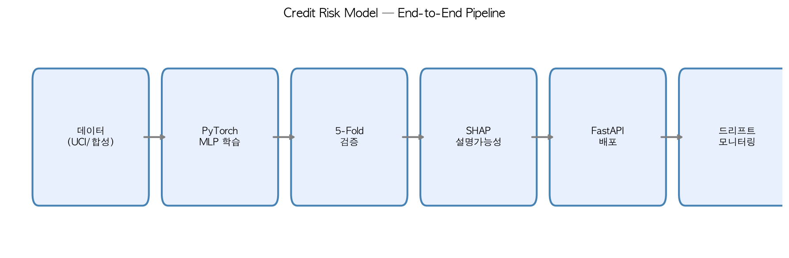

   

   

# Explainable Deep Learning for Credit Default Risk

카드사 리스크관리 실무를 겨냥한 프로젝트: PyTorch 기반 신용카드 대손(default)
예측 모델과, SHAP을 활용한 예측 설명가능성(explainability) 분석입니다.

## 배경
카드사 리스크관리/데이터분석 직무는 단순 예측 정확도뿐 아니라, 여신 거절이나
한도 조정의 근거를 설명할 수 있어야 하는 컴플라이언스 요구사항이 있습니다.
이 프로젝트는 예측 성능과 설명가능성을 함께 다뤘습니다.

## 데이터
UCI "Default of Credit Card Clients" 데이터셋(대만 카드사 실제 고객 데이터)
사용을 시도하며, 접근 불가 시 유사한 통계적 특성을 가진 합성 데이터로 대체하는
방어적 로직을 포함합니다.

## 모델 및 검증 방법론
- PyTorch MLP (BatchNorm, Dropout 포함), 클래스 불균형 보정을 위한 weighted BCE loss
- **5-Fold 교차검증**으로 성능의 통계적 안정성 검증 (평균 ROC-AUC, 표준편차 함께 보고)
- **Early stopping**으로 과적합 방지
- **Precision-Recall 곡선 기반 임계값 최적화** (기본 0.5가 아닌 F1 최적점 사용)
- **SHAP**을 이용한 개별 예측 및 전역 피처 중요도 설명

## 결과
- 5-Fold 평균 ROC-AUC: (실행 결과 값을 여기에 채워넣으세요)
- 최적 판단 임계값: (실행 결과 값을 여기에 채워넣으세요)

## 실행 방법
\`\`\`bash
pip install torch pandas numpy scikit-learn matplotlib requests shap openpyxl xlrd
python3 credit_risk_v2.py
\`\`\`

## 한계 및 다음 단계
- 합성 데이터로 대체될 경우, 실제 신용 패턴과 완전히 동일하지는 않음
- SHAP KernelExplainer는 배경 샘플 수와 nsamples에 따라 근사 정밀도가 달라짐
  (실무에서는 DeepExplainer/GradientExplainer로 정밀도 향상 가능)
